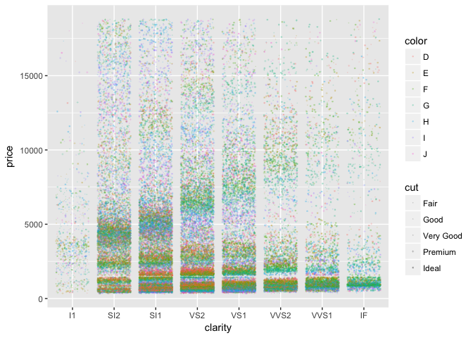

Diamonds Data Set
================
Daniel Longo
6/21/2017

Carat v.s. Price
----------------

``` r
diamonds %>%  
  ggplot(aes(carat,price)) +
  geom_jitter(alpha=.2) +
  geom_smooth(color="red")
```

    ## `geom_smooth()` using method = 'gam'


Clarity,Price,color,cut
-----------------------

``` r
diamonds %>%  
  ggplot(aes(clarity,price)) +
  geom_jitter(alpha=.2,aes(color=color,shape=cut),size=.2) +
  geom_smooth(color="red") 
```

    ## `geom_smooth()` using method = 'gam'



Cut v.s. Price
--------------

``` r
diamonds %>% 
  ggplot(aes(cut,price)) + # like a canvis 
  geom_boxplot(outlier.alpha = .05, outlier.color = 123) 
```


